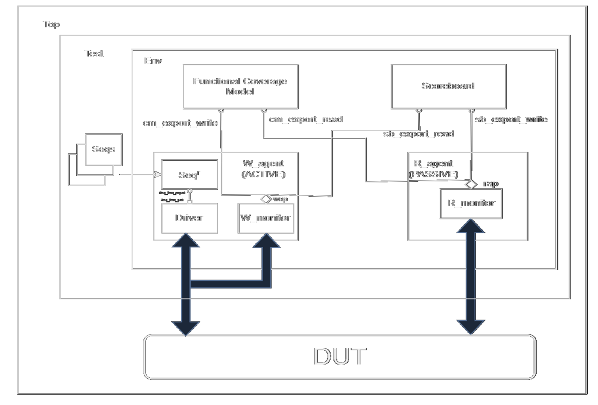

# APB UVM Environment - Main Repository

## Project Overview

This repository contains a Universal Verification Methodology (UVM) based testbench for verifying an Advanced Peripheral Bus (APB) slave device. It is structured to facilitate the development, simulation, and analysis of the APB slave design.



## Directory Structure

*   `apb_top.sv`: The top-level SystemVerilog file that instantiates the Design Under Test (DUT) and the UVM testbench environment.
*   `GEMINI.md`: Project context and guidelines for Gemini CLI interactions.
*   `README.md`: This file, providing an overview of the project structure and execution.
*   `image.png`: A diagram or image related to the project.
*   `apb_uvm_repo/`: This directory contains the core UVM testbench environment, including agents, sequences, scoreboard, and the DUT itself. This is where the main UVM verification components reside.
*   `env/`: (Likely a duplicate or older version of `apb_uvm_repo/env`) Contains UVM environment components.
*   `log/`: Stores simulation logs and output files.
*   `rep/`: Intended for reports (e.g., coverage reports).
*   `script/`: Contains utility scripts, such as the UVM log parser.
*   `sim/`: Holds simulation-related files, including build scripts and run commands.
*   `src/`: Contains the source code for the Design Under Test (DUT) and interfaces.
*   `test/`: Contains UVM test classes and sequences.

## Key Components

The primary UVM testbench components and DUT are located within the `apb_uvm_repo/` subdirectory. This includes:
*   **DUT:** `apb_uvm_repo/src/apb_dut.v`
*   **UVM Environment:** `apb_uvm_repo/env/apb_env.sv`
*   **Base Test:** `apb_uvm_repo/test/test_classes/apb_base_test.sv`
*   **Simulation Entry Point:** `apb_uvm_repo/apb_top.sv`

## How to Run Simulations

To execute simulations, you typically need to navigate into the `apb_uvm_repo/sim/` directory and use the provided batch scripts.

1.  **Navigate to the simulation directory:**
    ```bash
    cd apb_uvm_repo/sim
    ```
2.  **Run a specific test (e.g., `apb_directed_test`):**
    ```bash
    sim_go.bat apb_dut apb_top apb_directed_test
    ```
    *   `apb_dut`: The name of the DUT module.
    *   `apb_top`: The name of the top-level testbench module.
    *   `apb_directed_test`: The name of the UVM test to execute.

3.  **Clean simulation artifacts:**
    ```bash
    clean.bat
    ```

For more detailed instructions on running specific tests or understanding the UVM environment, please refer to the `README.md` located inside the `apb_uvm_repo/` directory.

## References

*   [APB Protocol Verification using UVM](https://github.com/PRADEEPCHANGAL/APB-Protocol-Verification-using-UVM)